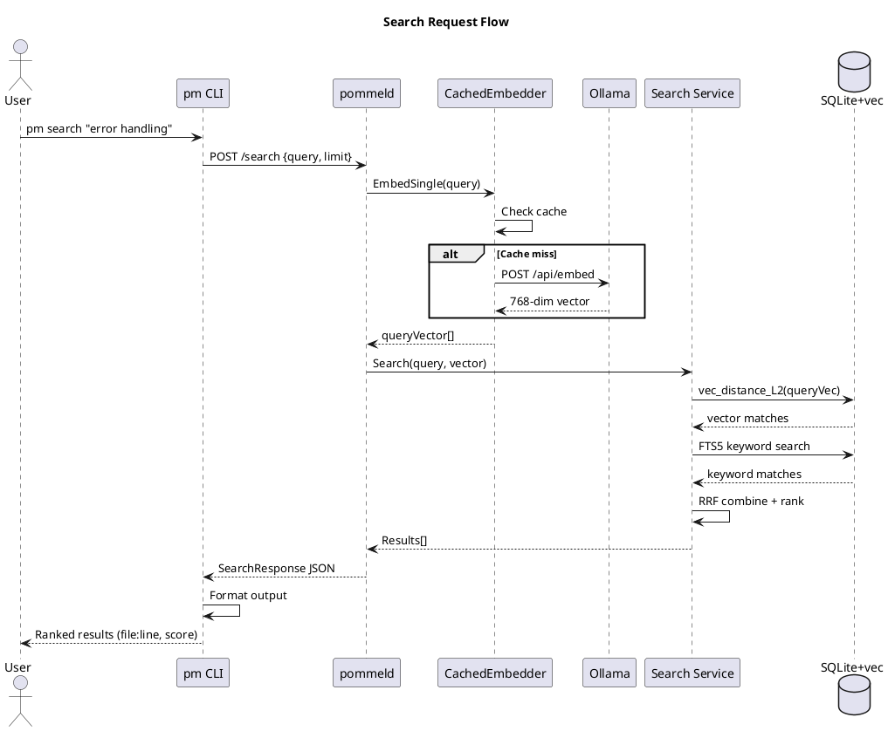
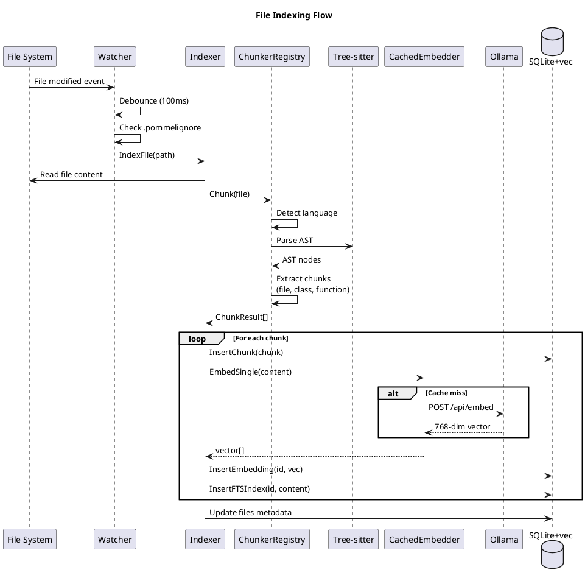
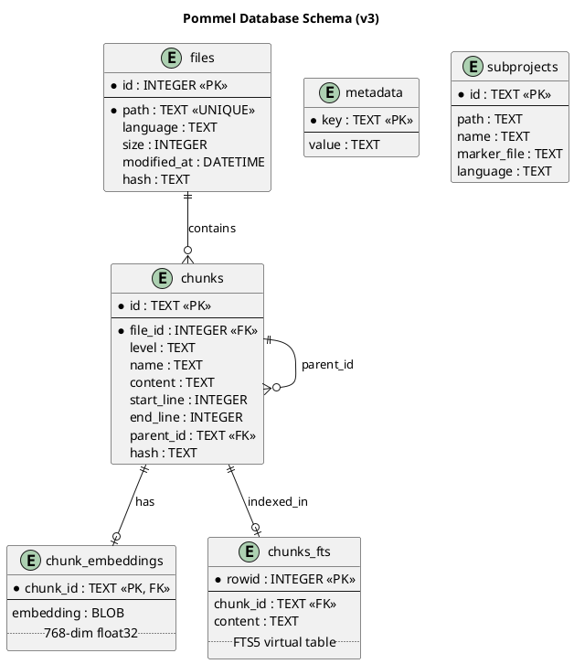
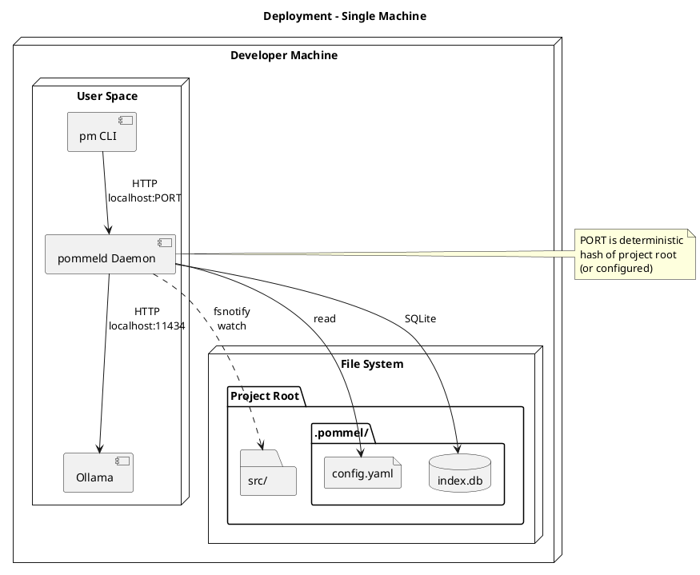
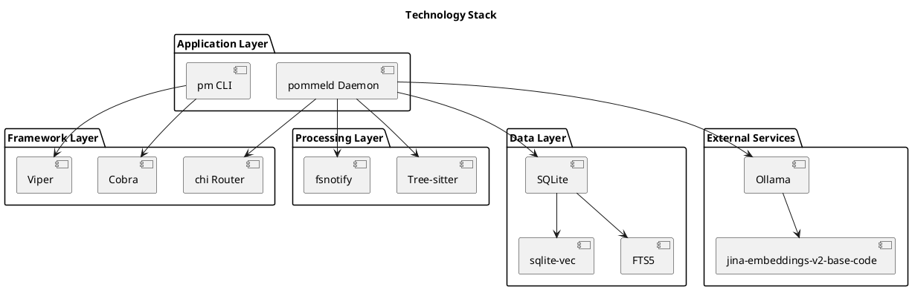
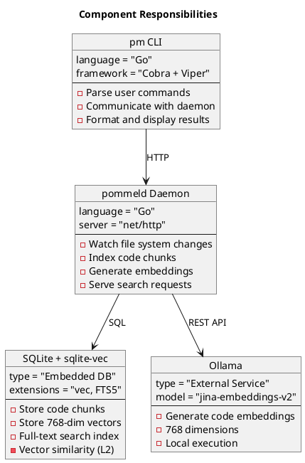

# Pommel Architecture (C4 Model - PlantUML)

This document describes Pommel's architecture using the [C4 model](https://c4model.com/) with PlantUML notation.

## Rendering

Render these diagrams using:
- [PlantUML Online Server](https://www.plantuml.com/plantuml/uml/)
- VS Code with PlantUML extension
- IntelliJ IDEA (built-in)
- CLI: `plantuml docs/architecture-plantuml.md`

---

## C1: System Context

```plantuml
@startuml C1_System_Context
!include https://raw.githubusercontent.com/plantuml-stdlib/C4-PlantUML/master/C4_Context.puml

title System Context - Pommel

Person(user, "Developer / AI Agent", "Claude Code, Cursor, Copilot, or human developer")

System(pommel, "Pommel", "Local-first semantic code search system maintaining vector DB of code embeddings")

System_Ext(ollama, "Ollama", "Local LLM runtime hosting jina-embeddings-v2-base-code model")
System_Ext(filesystem, "File System", "Source code files being indexed")

Rel(user, pommel, "pm search, init, start, status", "CLI")
Rel(pommel, ollama, "Generate embeddings", "HTTP POST /api/embed")
Rel(filesystem, pommel, "File change events", "fsnotify")
Rel(pommel, filesystem, "Read source files", "OS read")
Rel(pommel, user, "Ranked search results", "JSON")

@enduml
```

---

## C2: Container Diagram

```plantuml
@startuml C2_Container
!include https://raw.githubusercontent.com/plantuml-stdlib/C4-PlantUML/master/C4_Container.puml

title Container Diagram - Pommel

Person(user, "Developer / AI Agent")

System_Boundary(pommel, "Pommel System") {
    Container(cli, "pm", "Go Binary, Cobra + Viper", "CLI interface for search, init, start, stop, status, reindex commands")
    Container(daemon, "pommeld", "Go HTTP Server", "File watcher, indexer, search service, API endpoints")
    ContainerDb(db, "SQLite Database", "SQLite + sqlite-vec + FTS5", "Stores chunks, 768-dim vectors, full-text index, file metadata")
}

System_Ext(ollama, "Ollama", "jina-embeddings-v2-base-code")
System_Ext(fs, "File System", "Source code")

Rel(user, cli, "CLI commands")
Rel(cli, daemon, "HTTP GET/POST", "JSON")
Rel(daemon, db, "SQL queries", "sqlite-vec")
Rel(daemon, ollama, "Generate embeddings", "POST /api/embed")
Rel(fs, daemon, "File events", "fsnotify")
Rel(daemon, fs, "Read files")
Rel(cli, user, "Search results", "JSON/Table")

@enduml
```

---

## C3: Component Diagram - Daemon

```plantuml
@startuml C3_Daemon_Components
!include https://raw.githubusercontent.com/plantuml-stdlib/C4-PlantUML/master/C4_Component.puml

title Component Diagram - pommeld Daemon

Container_Boundary(daemon, "pommeld (Daemon)") {

    Component(router, "Router", "http.ServeMux", "HTTP request routing")
    Component(handlers, "API Handlers", "internal/api", "health, status, search, reindex endpoints")

    Component(watcher, "Watcher", "internal/daemon/watcher.go", "fsnotify file watching, debouncing, .pommelignore filtering")
    Component(indexer, "Indexer", "internal/daemon/indexer.go", "Orchestrates chunking and embedding")
    Component(search_svc, "Search Service", "internal/search", "Vector similarity, hybrid RRF ranking, filtering")
    Component(state, "State Manager", "internal/daemon/state.go", "PID tracking, daemon lifecycle")

    Component(chunker_reg, "Chunker Registry", "internal/chunker", "Routes files to chunker by language")
    Component(generic_chunker, "Generic Chunker", "internal/chunker", "Tree-sitter AST parsing")
    Component(fallback_chunker, "Fallback Chunker", "internal/chunker", "Line-based for unknown languages")

    Component(cached_embed, "Cached Embedder", "internal/embedder/cache.go", "LRU cache wrapper")
    Component(ollama_client, "Ollama Client", "internal/embedder/ollama.go", "HTTP client for embeddings")

    Component(db_layer, "DB Layer", "internal/db", "Chunks, vectors, FTS, files")
}

Container_Ext(cli, "pm CLI")
Container_Ext(ollama, "Ollama")
Container_Ext(fs, "File System")
ContainerDb_Ext(sqlite, "SQLite + vec")

Rel(cli, router, "HTTP")
Rel(router, handlers, "Routes")
Rel(handlers, search_svc, "Search requests")
Rel(handlers, indexer, "Reindex requests")

Rel(fs, watcher, "fsnotify events")
Rel(watcher, indexer, "File events")

Rel(indexer, chunker_reg, "Chunk file")
Rel(chunker_reg, generic_chunker, "Supported languages")
Rel(chunker_reg, fallback_chunker, "Unknown languages")

Rel(indexer, cached_embed, "Generate embeddings")
Rel(cached_embed, ollama_client, "Cache miss")
Rel(ollama_client, ollama, "POST /api/embed")

Rel(search_svc, cached_embed, "Embed query")
Rel(search_svc, db_layer, "Vector + FTS search")
Rel(indexer, db_layer, "Store chunks")
Rel(db_layer, sqlite, "SQL")

@enduml
```

---

## C3: Component Diagram - CLI

```plantuml
@startuml C3_CLI_Components
!include https://raw.githubusercontent.com/plantuml-stdlib/C4-PlantUML/master/C4_Component.puml

title Component Diagram - pm CLI

Container_Boundary(cli, "pm (CLI)") {

    Component(root_cmd, "Root Command", "internal/cli/root.go", "Cobra rootCmd, global flags, version")

    Component(init_cmd, "init", "internal/cli/init.go", "--auto --claude --start flags")
    Component(search_cmd, "search", "internal/cli/search.go", "--limit --level --json --path flags")
    Component(start_cmd, "start", "internal/cli/start.go", "Spawn daemon process")
    Component(stop_cmd, "stop", "internal/cli/stop.go", "Kill daemon process")
    Component(status_cmd, "status", "internal/cli/status.go", "Index statistics")
    Component(reindex_cmd, "reindex", "internal/cli/reindex.go", "Force full reindex")
    Component(config_cmd, "config", "internal/cli/config.go", "View/edit configuration")

    Component(client, "HTTP Client", "internal/cli/client.go", "Health(), Status(), Search(), Reindex()")
    Component(output, "Output Formatter", "internal/output", "Table, JSON, verbose formatting")
    Component(config_loader, "Config Loader", "internal/config", ".pommel/config.yaml parsing")
}

Person_Ext(user, "User")
Container_Ext(daemon, "pommeld")

Rel(user, root_cmd, "CLI input")
Rel(root_cmd, init_cmd, "pm init")
Rel(root_cmd, search_cmd, "pm search")
Rel(root_cmd, start_cmd, "pm start")
Rel(root_cmd, stop_cmd, "pm stop")
Rel(root_cmd, status_cmd, "pm status")
Rel(root_cmd, reindex_cmd, "pm reindex")
Rel(root_cmd, config_cmd, "pm config")

Rel(search_cmd, client, "Search request")
Rel(status_cmd, client, "Status request")
Rel(reindex_cmd, client, "Reindex request")

Rel(client, daemon, "HTTP")

Rel(init_cmd, config_loader, "Generate config")
Rel(search_cmd, output, "Format results")
Rel(status_cmd, output, "Format status")

Rel(output, user, "Display")

@enduml
```

---

## Sequence Diagram: Search Request



---

## Sequence Diagram: File Indexing



---

## Database Schema (ERD)



---

## Deployment Diagram



---

## Technology Stack



---

## Component Responsibilities



---

## Quick Reference

| Diagram | What it Shows |
|---------|---------------|
| C1 System Context | Pommel + external actors (users, Ollama, file system) |
| C2 Container | pm CLI, pommeld daemon, SQLite database |
| C3 Daemon | Internal components: watcher, indexer, chunker, embedder, search |
| C3 CLI | Commands, HTTP client, output formatter, config loader |
| Search Sequence | Query flow from user to ranked results |
| Indexing Sequence | File change to stored vectors |
| Database ERD | Schema with chunks, embeddings, FTS |
| Deployment | Single-machine local setup |

---

## Generating Images

```bash
# Install PlantUML
brew install plantuml  # macOS
apt install plantuml   # Linux

# Generate PNGs from this file
plantuml -tpng docs/architecture-plantuml.md

# Generate SVGs
plantuml -tsvg docs/architecture-plantuml.md

# Or use the online server
# https://www.plantuml.com/plantuml/uml/
```
