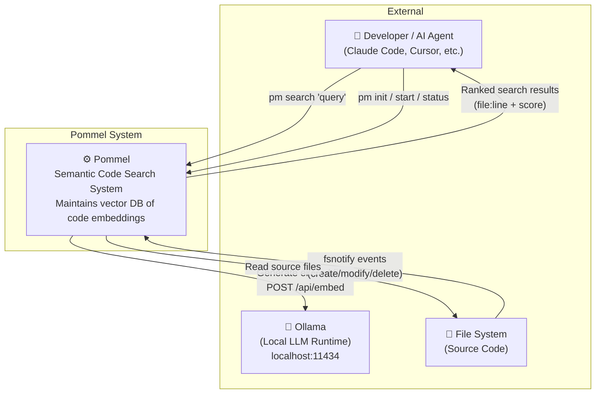
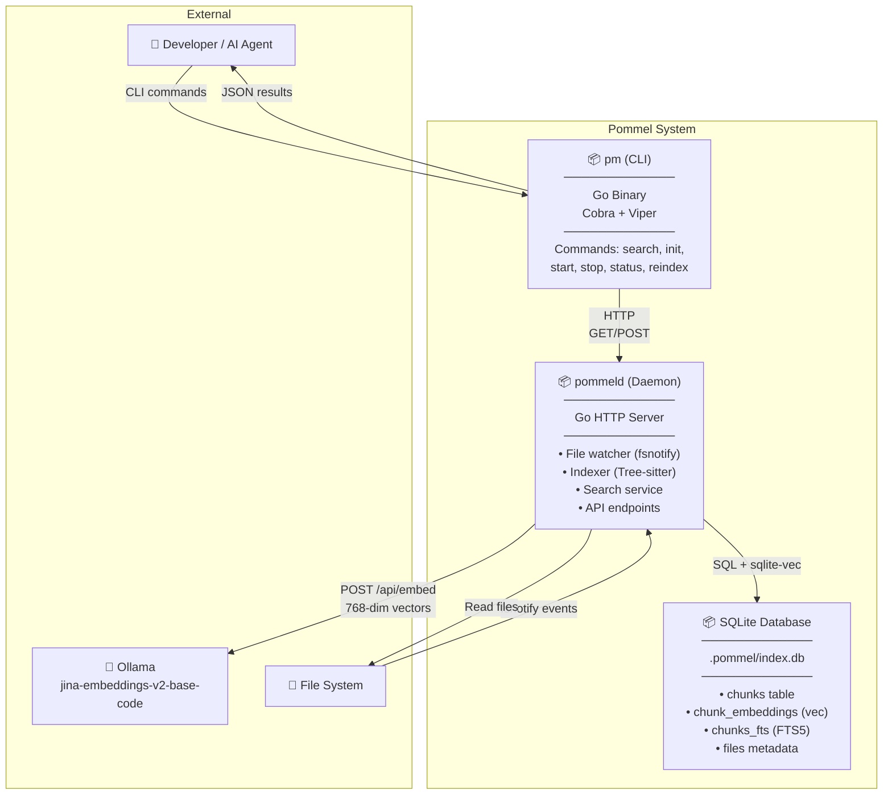
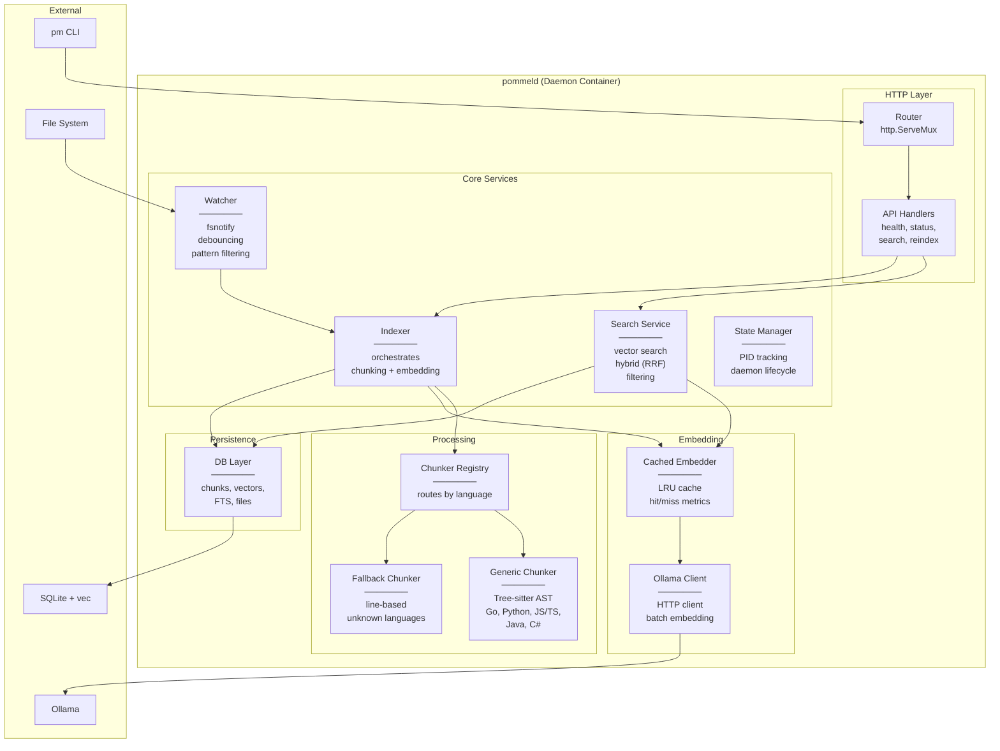
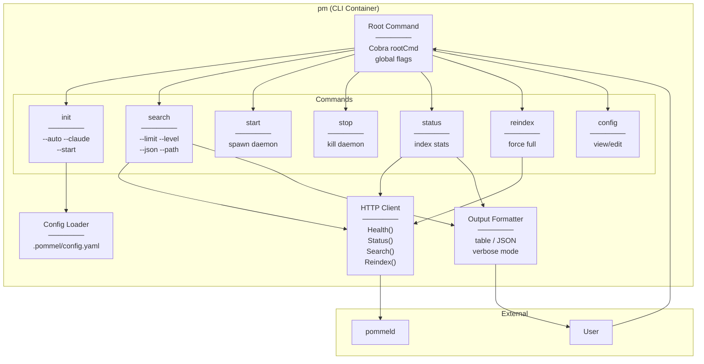
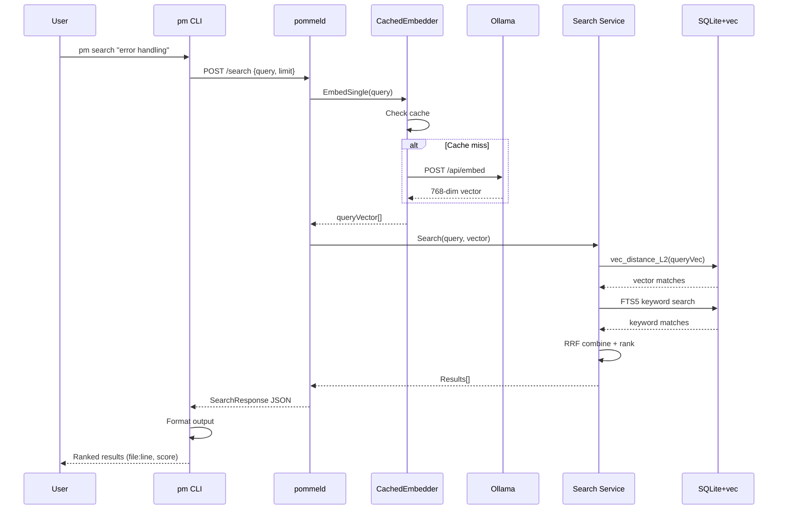
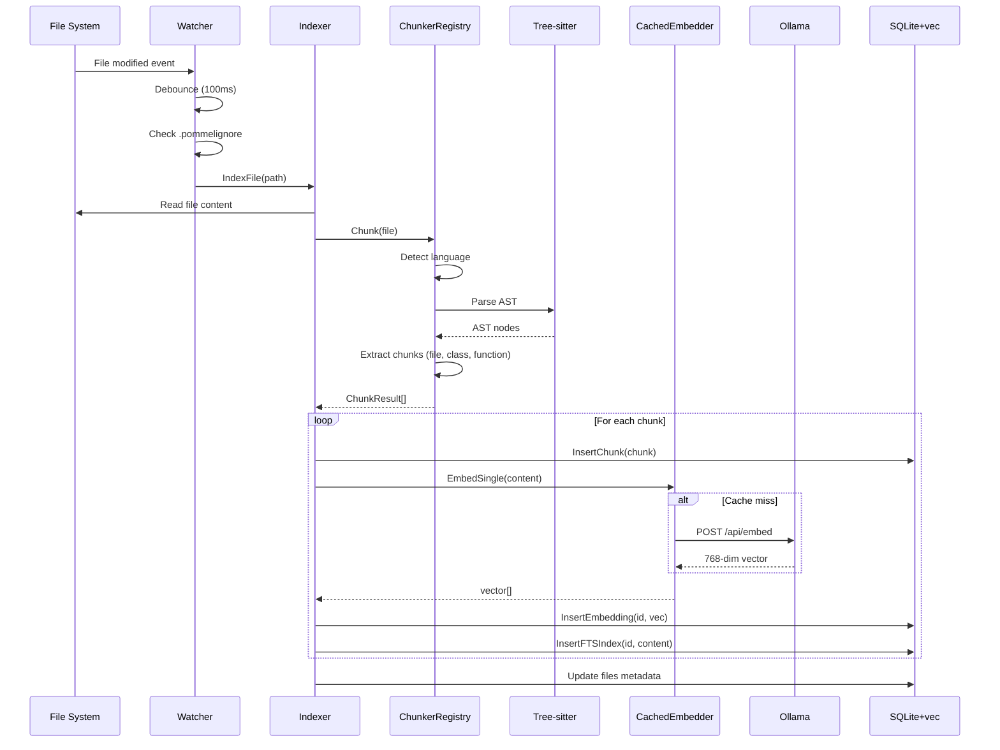
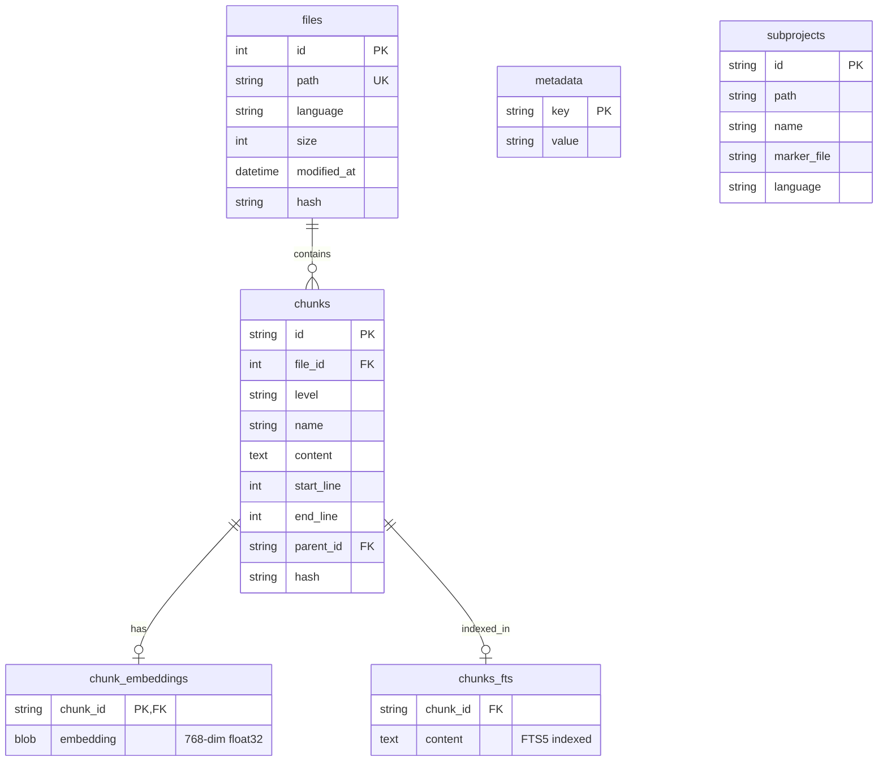

# Pommel Architecture (C4 Model)

This document describes Pommel's architecture using the [C4 model](https://c4model.com/) notation. Diagrams are in Mermaid format and render in GitHub, Obsidian, and most markdown viewers.

## Overview

Pommel is a **local-first semantic code search system** that:
- Maintains an always-current vector database of code embeddings
- Reduces AI agent context window consumption by 60-80%
- Enables natural language queries against codebases

---

## C1: System Context

Shows Pommel's relationship with external actors and systems.



### Actors & Systems

| Element | Description |
|---------|-------------|
| **Developer / AI Agent** | Primary users - humans via CLI or AI coding assistants |
| **Ollama** | Local LLM runtime hosting jina-embeddings-v2-base-code model |
| **File System** | Source code being indexed and searched |
| **Pommel** | The semantic search system maintaining embeddings |

---

## C2: Container Diagram

Shows the main deployable units and their interactions.



### Containers

| Container | Technology | Responsibility |
|-----------|------------|----------------|
| **pm (CLI)** | Go + Cobra | User interface, command parsing, daemon communication |
| **pommeld (Daemon)** | Go + http.Server | File watching, indexing, embedding, search serving |
| **SQLite Database** | SQLite + sqlite-vec + FTS5 | Persistent storage of chunks, vectors, and full-text index |

---

## C3: Component Diagram - Daemon

Shows internal components of the pommeld daemon.



### Daemon Components

| Component | Package | Responsibility |
|-----------|---------|----------------|
| **Router** | `internal/daemon` | HTTP request routing |
| **API Handlers** | `internal/api` | Request/response handling for health, status, search, reindex |
| **Watcher** | `internal/daemon/watcher.go` | fsnotify file watching with debouncing and .pommelignore filtering |
| **Indexer** | `internal/daemon/indexer.go` | Orchestrates chunking and embedding for file changes |
| **Search Service** | `internal/search` | Vector similarity search, hybrid RRF ranking, filtering |
| **State Manager** | `internal/daemon/state.go` | PID file management, daemon lifecycle |
| **Chunker Registry** | `internal/chunker` | Routes files to appropriate chunker by language |
| **Generic Chunker** | `internal/chunker` | Tree-sitter AST parsing for supported languages |
| **Fallback Chunker** | `internal/chunker` | Line-based chunking for unknown languages |
| **Cached Embedder** | `internal/embedder/cache.go` | LRU cache wrapper for embeddings |
| **Ollama Client** | `internal/embedder/ollama.go` | HTTP client for Ollama embedding API |
| **DB Layer** | `internal/db` | SQLite operations for chunks, vectors, FTS |

---

## C3: Component Diagram - CLI

Shows internal components of the pm CLI.



### CLI Components

| Component | File | Responsibility |
|-----------|------|----------------|
| **Root Command** | `internal/cli/root.go` | Cobra root, global flags, version |
| **init** | `internal/cli/init.go` | Project initialization, config generation |
| **search** | `internal/cli/search.go` | Query parsing, result display |
| **start/stop** | `internal/cli/start.go`, `stop.go` | Daemon process management |
| **status** | `internal/cli/status.go` | Index statistics display |
| **reindex** | `internal/cli/reindex.go` | Force full reindex |
| **config** | `internal/cli/config.go` | View/modify configuration |
| **HTTP Client** | `internal/cli/client.go` | Daemon communication |
| **Output Formatter** | `internal/output` | Table, JSON, verbose formatting |
| **Config Loader** | `internal/config` | YAML config parsing and validation |

---

## Sequence Diagrams

### Search Request Flow



### File Indexing Flow



---

## Database Schema (v3)



---

## Key Interfaces

### Embedder Interface

```go
type Embedder interface {
    EmbedSingle(ctx context.Context, text string) ([]float32, error)
    Embed(ctx context.Context, texts []string) ([][]float32, error)
    Health(ctx context.Context) error
    ModelName() string
    Dimensions() int
}
```

Implementations:
- `OllamaClient` - HTTP client to Ollama API
- `CachedEmbedder` - LRU cache wrapper

### Chunker Interface

```go
type Chunker interface {
    Chunk(ctx context.Context, file *models.SourceFile) (*models.ChunkResult, error)
    Language() Language
}
```

Implementations:
- `GenericChunker` - Tree-sitter based, config-driven
- `FallbackChunker` - Line-based for unknown languages

### Searcher Interface

```go
type Searcher interface {
    Search(ctx context.Context, req SearchRequest) (*SearchResponse, error)
}
```

---

## Technology Stack

| Layer | Technology |
|-------|------------|
| Language | Go 1.24+ |
| CLI Framework | Cobra + Viper |
| HTTP Server | net/http + chi (optional) |
| Vector Database | SQLite + sqlite-vec |
| Full-Text Search | SQLite FTS5 |
| Code Parsing | Tree-sitter |
| Embedding Model | jina-embeddings-v2-base-code (768-dim) |
| Embedding Runtime | Ollama |
| File Watching | fsnotify |
| Platforms | macOS, Linux, Windows (x64/ARM64) |

---

## Project Structure

```
pommel/
├── cmd/
│   ├── pm/              # CLI entry point
│   └── pommeld/         # Daemon entry point
├── internal/
│   ├── api/             # HTTP API types and handlers
│   ├── chunker/         # Tree-sitter based code chunking
│   ├── cli/             # Cobra command implementations
│   ├── config/          # YAML configuration loading
│   ├── daemon/          # Daemon server, watcher, indexer
│   ├── db/              # SQLite + sqlite-vec database layer
│   ├── embedder/        # Ollama embedding client + cache
│   ├── models/          # Shared data models
│   ├── output/          # CLI output formatting
│   └── search/          # Vector similarity search + hybrid
├── languages/           # Language config YAML files
├── scripts/             # Installation scripts
├── docs/                # Documentation
└── .pommel/             # Per-project data (gitignored)
    ├── config.yaml      # Project configuration
    └── index.db         # SQLite database with vectors
```

---

## Rendering These Diagrams

These Mermaid diagrams render natively in:
- GitHub (README, issues, PRs)
- GitLab
- Obsidian
- Notion (with Mermaid block)
- VS Code (with Mermaid extension)

For standalone images, use [mermaid.live](https://mermaid.live) or the Mermaid CLI:

```bash
npm install -g @mermaid-js/mermaid-cli
mmdc -i docs/architecture.md -o docs/architecture.png
```
